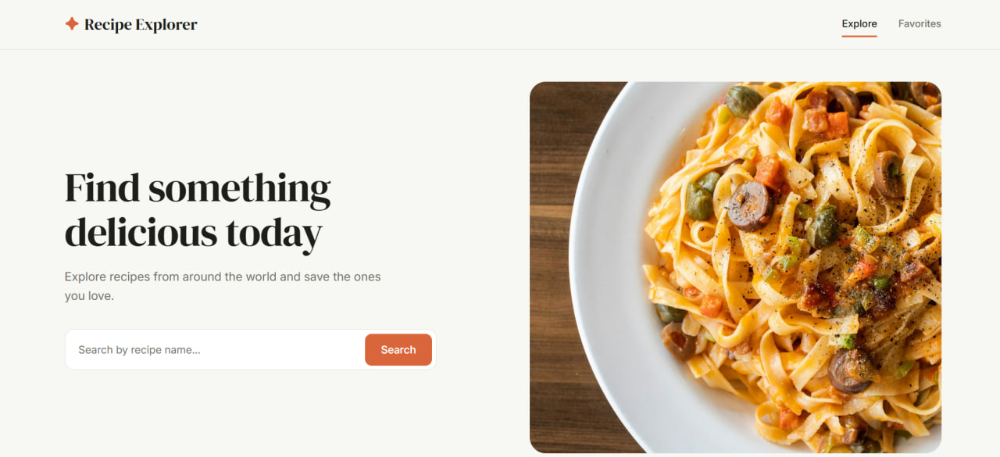
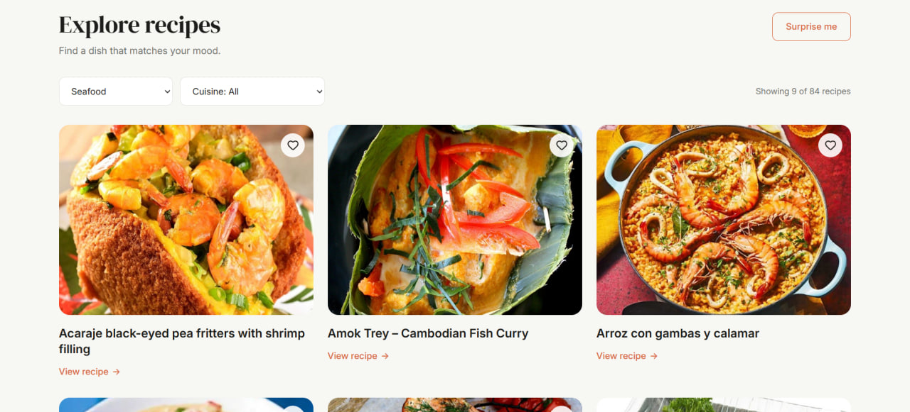
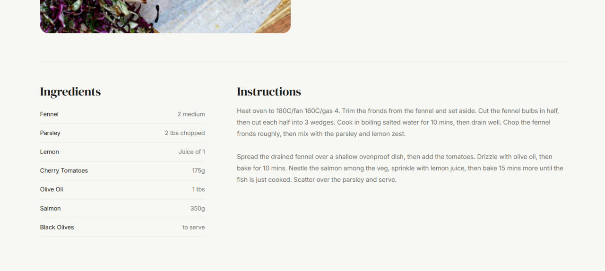
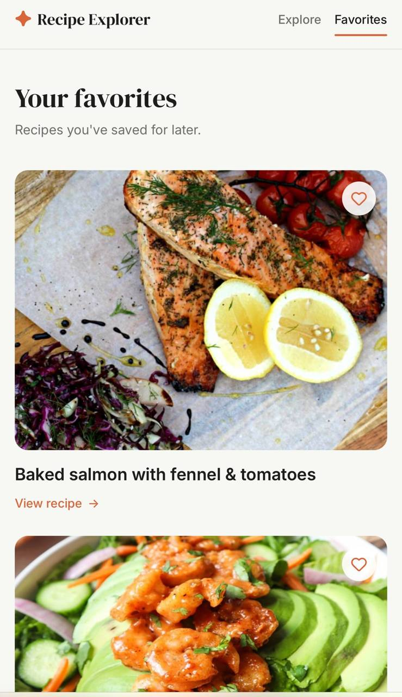
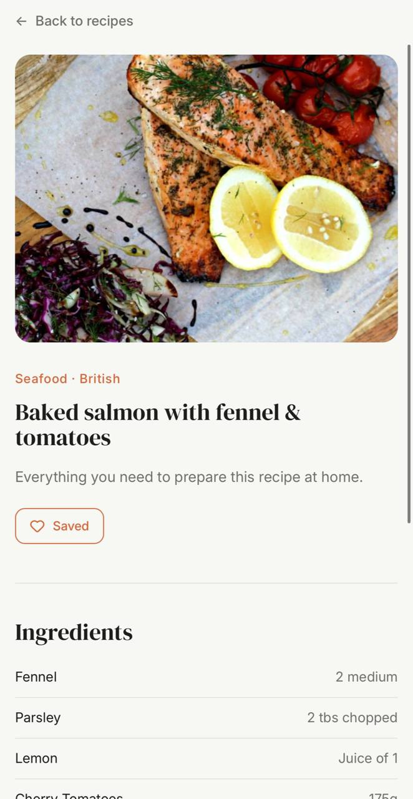

# Recipe Explorer

Recipe Explorer is a responsive web application for discovering recipes from around the world.

Users can search for recipes, filter them by category and cuisine, view detailed cooking instructions, discover a random recipe, and save favorites for later.

The project is built with Vanilla JavaScript and uses TheMealDB API for recipe data.

## Live Demo

[View live website](https://viktoriia-k88.github.io/recipe-explorer/)

## Screenshots

### Home



### Explore Recipes



### Recipe Details



### Favorites — Mobile



### Recipe Details — Mobile



## Features

- Search recipes by name
- Filter recipes by category
- Filter recipes by cuisine
- Combine category and cuisine filters
- Discover a random recipe
- Load more recipes
- View recipe details, ingredients, and instructions
- Save and remove favorite recipes
- Persist favorites with localStorage
- Loading, empty, and error states
- Responsive layout for desktop, tablet, and mobile
- Keyboard focus states and accessible form labels

## Tech Stack

- HTML5
- SCSS
- Vanilla JavaScript
- Vite
- TheMealDB API
- localStorage
- Vitest
- jsdom

## Pages

### Explore

The main page allows users to search recipes, apply filters, discover random recipes, and browse recipe cards.

### Recipe Details

Each recipe has its own detail page with:

- recipe image
- category and cuisine
- ingredients and measurements
- cooking instructions
- favorite button

### Favorites

Saved recipes are stored in localStorage and displayed on a separate Favorites page.

## API

Recipe data is provided by [TheMealDB](https://www.themealdb.com/api.php).

The application uses API endpoints for:

- searching recipes by name
- filtering by category
- filtering by cuisine
- retrieving recipe details by ID
- retrieving a random recipe

## Testing

The project includes unit tests for the Favorites storage logic using Vitest and jsdom.

The tests cover:

- adding a recipe to favorites
- removing a recipe from favorites
- checking favorite status
- handling invalid localStorage data

Run the tests with:

```bash
npm test
```

## Getting Started

Clone the repository:

```bash
git clone https://github.com/Viktoriia-K88/recipe-explorer
```

Open the project directory:

```bash
cd recipe-explorer
```

Install dependencies:

```bash
npm install
```

Start the development server:

```bash
npm run dev
```

Create a production build:

```bash
npm run build
```

## Project Structure

```text
recipe-explorer/
├── public/
├── screenshots/
├── src/
│   ├── assets/
│   ├── js/
│   │   ├── api/
│   │   ├── storage/
│   │   └── ui/
│   ├── scss/
│   │   ├── abstracts/
│   │   ├── base/
│   │   ├── components/
│   │   └── layout/
│   ├── favorites.js
│   ├── main.js
│   └── recipe.js
├── favorites.html
├── index.html
├── recipe.html
├── package.json
└── README.md
```
